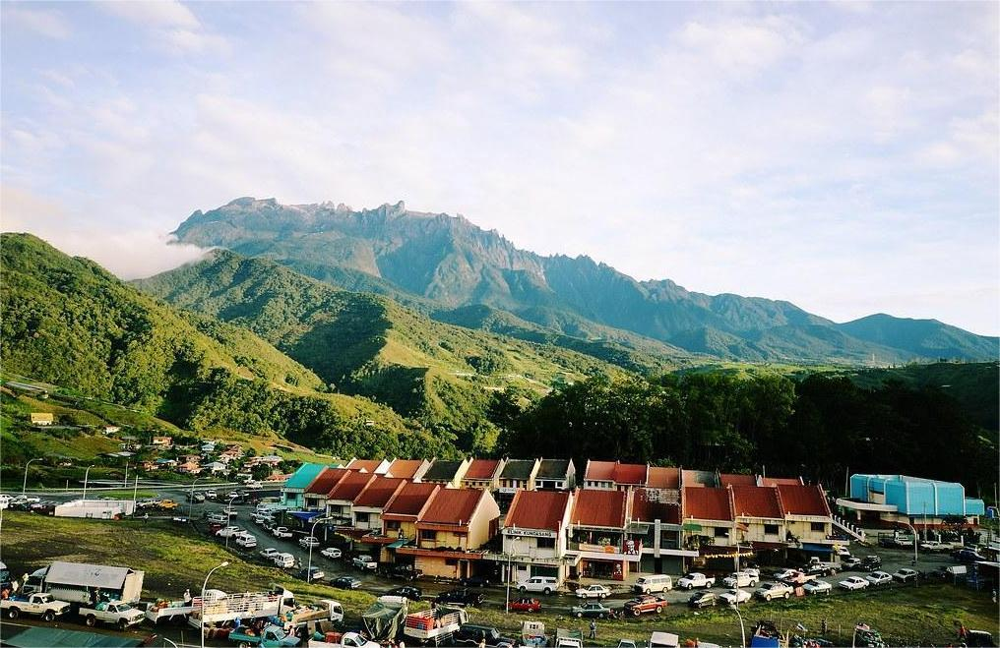
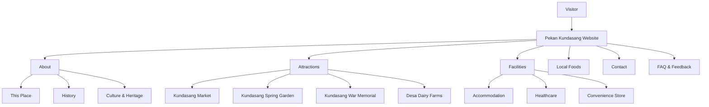
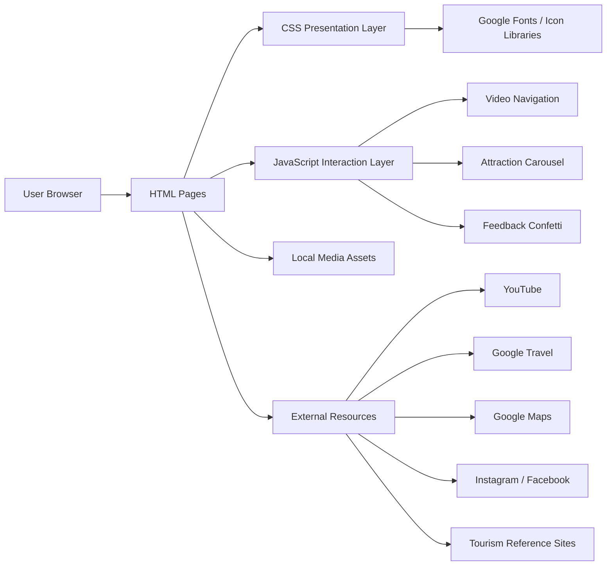
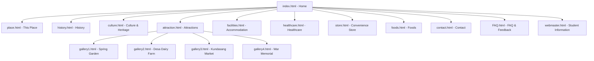

<p align="center">
  
</p>

<h1 align="center">Pekan Kundasang Local Community Website</h1>

<p align="center">
  A multimedia local community information website developed to present the attractions, culture, history, facilities, food and visitor information of Pekan Kundasang, Sabah in one organised digital platform.
</p>

<p align="center">
  <a href="https://aqimsyz.github.io/SQ/LOCAL_COMMUNITY_WEBSITE/"><strong>🌐 View Live Website</strong></a>
</p>

<p align="center">
  
  
  
  
</p>

<p align="center">
  
</p>

---

## 📌 Project Overview

**Pekan Kundasang Local Community Website** is a front-end web project that brings together important information about Pekan Kundasang, Sabah in a structured and visually engaging website.

The website was developed as an academic project for **IMS458 – Web Design and Development**. From an Information System Management perspective, the project focuses not only on visual design, but also on how community information can be **organised, categorised, presented and accessed efficiently by users**.

The website works as a digital information hub for visitors who want to learn about Pekan Kundasang before or during their visit. It combines written information, photographs, videos, interactive components and external reference links within a multi-page navigation structure.

### Project Status

**Completed academic web system** — designed, developed and published as a working local community website.

---

## 🎓 Academic Context

| Item | Details |
|---|---|
| Project | Pekan Kundasang Local Community Website |
| Course Code | IMS458 |
| Course | Web Design and Development |
| Project Type | Local Community Information Website |
| Group | Group 1 |
| Submission | 10 February 2025 |
| Developers | Syazwan Aqim & Ahmad Naqiu Dinie Bin Othman |
| Deployment | GitHub Pages |

This project demonstrates the practical application of web development and information organisation skills in creating a usable community-based information system.

---

## 🎯 Project Objectives

The main objectives of the project are to:

- Develop a centralised website containing important information about Pekan Kundasang.
- Organise community information into clear and understandable categories.
- Introduce visitors to the town's history, local culture and heritage.
- Promote important tourist attractions and visitor activities.
- Provide useful information about accommodation, healthcare and convenience facilities.
- Introduce traditional Sabahan food connected to the local community.
- Provide an interactive FAQ section for common visitor questions.
- Provide contact and feedback interfaces for user communication.
- Integrate multimedia elements such as images, video and external web resources.
- Apply HTML, CSS and JavaScript concepts in a complete multi-page website.

---

As an Information System Management project, the website is designed around the idea of converting scattered community information into a structured digital resource.

The information is divided into logical modules so users can quickly find what they need:



This structure helps improve **information accessibility, navigation clarity and user experience** while presenting local information in one consistent platform.

---

# ✨ Main System Features

## 1. Multimedia Landing Page

The homepage provides the main introduction to Pekan Kundasang using full-screen video backgrounds and animated content.

Key elements include:

- Two locally stored Pekan Kundasang background videos.
- Manual video-slide navigation controls.
- Circular clip-path transition between video slides.
- Animated typing effect for the main heading.
- Delayed fade-in animation for introductory text.
- Facebook and Instagram links.
- Main navigation bar with dropdown menus.
- Mobile navigation control for smaller screen widths.
- Project logo linked to the student information page.

The homepage JavaScript dynamically changes the active video and navigation indicator based on the user's selection.

---

## 2. About Pekan Kundasang

The **This Place** page introduces Pekan Kundasang and explains its location, climate, agricultural activities, tourism value and connection to Mount Kinabalu.

It combines:

- Written community information.
- Full-page visual background styling.
- Embedded YouTube video content.
- Consistent main navigation.
- Custom cursor styling.

---

## 3. History Module

The history section explains the development of Pekan Kundasang from early settlement to the present day.

The page presents four historical stages:

- **Early Settlement**
- **Colonial Era**
- **World War II Impact**
- **Modern Growth**

Each stage is displayed using visual history cards with background images and hover-based content presentation.

---

## 4. Culture & Heritage Module

The Culture and Heritage page highlights important elements of the local Dusun community.

The content is organised into three visual cards:

### Agricultural Traditions
Explains the importance of traditional farming and local crops to the community and economy.

### Festivals & Beliefs
Introduces the Kaamatan Festival and the cultural and spiritual significance of Mount Kinabalu.

### Craftsmanship & Markets
Highlights local weaving, beadwork, traditional produce and community markets.

The page uses a grid-based card layout with local photographs and visual styling to make cultural information easy to understand.

---

## 5. Interactive Attractions Carousel

The Attractions page uses a custom JavaScript-powered carousel to showcase four major places of interest:

- **Kundasang Market**
- **Kundasang Spring Garden**
- **Kundasang War Memorial**
- **Desa Dairy Farms**

The carousel includes:

- Large active attraction display.
- Background image presentation.
- Attraction name and description.
- Animated text and button entrance.
- Previous and next navigation buttons.
- Direct access to dedicated image galleries.

The carousel works by dynamically rearranging `.item` elements in the DOM using `appendChild()` and `prepend()`.

---

## 6. Attraction Gallery System

Four dedicated gallery pages provide additional visual information for each attraction.

| Gallery | Content | Images | External Information |
|---|---|---:|---|
| `gallery1.html` | Kundasang Spring Garden | 6 | Sabah Travel |
| `gallery2.html` | Desa Dairy Farms | 6 | Sabah Tourism |
| `gallery3.html` | Kundasang Market | 6 | Tripadvisor |
| `gallery4.html` | Kundasang War Memorial | 6 | Reference information |

Each gallery provides:

- A three-column CSS Grid image layout.
- Six attraction photographs.
- Attraction-specific background image.
- Blurred background visual effect.
- Hover animation on action buttons.
- **Back** navigation using `window.history.back()`.
- **Learn More** link to an external source.

---

## 7. Accommodation Information

The accommodation page provides information about selected places to stay around Kundasang, including:

- Crystal Hill R
- Kinabalu Park / Mountain Lodge
- Mile 36 Lodge
- Hotel Perkasa Kundasang

The page combines:

- Informational text.
- Four accommodation photographs.
- Two-column image presentation.
- Image hover effects.
- External Google Travel search access.

---

## 8. Healthcare Information

The healthcare module provides visitor information about healthcare services available around Pekan Kundasang.

It introduces:

- Klinik Kundasang
- Klinik Dr Faezah

The section also contains:

- Clinic-related images.
- Clinic information and operating context.
- Direct external link to Klinik Dr Faezah's Instagram page.
- Consistent visual layout with the other facilities pages.

---

## 9. Convenience Store Information

The convenience store page introduces **88 Fresh Mart** as a local shopping option for visitors and residents.

The page contains:

- Store description.
- Information about store convenience and product availability.
- Four store photographs.
- Image hover effects.
- Direct Google Maps access for location information.

---

## 10. Traditional Food Showcase

The food module introduces three Sabah traditional foods:

### Hinava
A traditional Kadazan-Dusun fish dish prepared with lime juice, chilli, shallots and ginger.

### Sambal Tuhau
A traditional Sabahan condiment made using wild ginger shoots with chilli and other ingredients.

### Linopot
A traditional rice dish wrapped in leaves and associated with Kadazan-Dusun cuisine.

The food page includes:

- Alternating image-and-text layouts.
- Food photographs.
- External educational links.
- Decorative SVG wave dividers.
- Hover-styled action buttons.
- Responsive layout rules for smaller displays.
- Custom visual effects and animations.

---

## 11. Contact Module

The Contact page presents community contact information in a clear two-section layout.

Displayed information includes:

- Phone number.
- Email address.
- Pekan Kundasang address.

The contact interface also contains a user message form with fields for:

- Full Name
- Email Address
- Phone Number
- Email Subject
- Message

The page uses Boxicons for contact icons and a CSS-generated animated gradient background effect.

---

## 12. FAQ Accordion

The FAQ module contains **10 frequently asked visitor questions** covering topics such as:

- Reasons for visiting Kundasang.
- Local transportation.
- Mount Kinabalu access.
- Tour guides.
- Travel time from Kota Kinabalu.
- Wildlife.
- Family suitability.
- Mobile network coverage.
- Strawberry picking.
- Recommended length of stay.

The accordion is implemented using HTML checkbox inputs and CSS selectors rather than requiring JavaScript for opening and closing answers.

Features include:

- Expandable question-and-answer items.
- Smooth max-height transitions.
- Visual open/close indicators.
- Scrollable FAQ container.
- Sticky FAQ heading.

---

## 13. Interactive Feedback Form

The FAQ page also includes a feedback form containing:

- Name field.
- Email field.
- Feedback textarea.
- Required input validation through HTML attributes.
- Animated input and button styling.

When the feedback button is activated, JavaScript:

1. Prevents the default page submission.
2. Clears the entered name.
3. Clears the entered email.
4. Clears the feedback message.
5. Launches a large confetti animation using the Canvas Confetti library.

The confetti effect is configured with **1,500 particles** and a wide spread for a strong visual confirmation effect.

---

## 14. Student Information Page

The project contains a dedicated student information page accessible through the website logo.

It includes:

- Student photographs.
- Project title.
- Developer names.
- Course information.
- Group information.
- Submission information.
- Published project URL.
- Back-navigation button.
- UiTM-themed background image.

This page documents the academic ownership and context of the project.

---

# 🏗️ System Architecture

The project is designed as a **client-side static information system**. All core website content, media and user-interface logic are handled directly by the browser.



# 🧭 Website Navigation Flow



---

# 🛠️ Technology Stack

| Category | Technology | Purpose |
|---|---|---|
| Structure | HTML5 | Multi-page website structure and content |
| Styling | CSS3 | Layout, colours, animations, hover effects and responsive rules |
| Interaction | JavaScript | Video switching, carousel control and feedback interaction |
| Layout | Flexbox & CSS Grid | Content alignment and gallery structures |
| Icons | Font Awesome | Navigation and carousel icons |
| Icons | Boxicons | Contact information icons |
| Icons | Remix Icon | FAQ interface icons |
| Typography | Google Fonts | Poppins and Candal typography |
| Animation Library | Canvas Confetti | Feedback confirmation animation |
| Video | HTML5 Video | Full-screen homepage background videos |
| Embedded Media | YouTube iframe | Community video content |
| Hosting | GitHub Pages | Public website deployment |
| Version Control | Git / GitHub | Source-code management and project publishing |

---

# 🎨 Front-End Design Implementation

The visual design uses several front-end techniques across the website:

- Full-screen background videos.
- Background image overlays.
- Blurred background effects.
- Flexbox-based page layouts.
- CSS Grid image galleries.
- Dropdown navigation menus.
- Hover animations.
- Animated buttons.
- Custom mouse cursors on selected pages.
- Typing animations.
- Fade-in animations.
- Carousel transition animations.
- Gradient backgrounds.
- Sticky FAQ headings.
- Expandable CSS accordion items.
- SVG wave separators.
- Responsive media queries.
- Fixed footer presentation across the main content pages.

The overall interface uses nature-oriented imagery, green accent colours and mountain/community visuals to match the identity of Kundasang.

---

# ⚙️ JavaScript Implementation

## Homepage Video Navigation

The homepage contains inline JavaScript that:

- Detects menu button clicks.
- Toggles mobile navigation visibility.
- Identifies video navigation buttons.
- Removes the active class from the current video.
- Assigns the active class to the selected video.
- Updates the matching navigation indicator.

## Attraction Carousel — `home.js`

The attraction carousel uses DOM manipulation to rearrange attraction cards.

**Next button:**

```javascript
let items = document.querySelectorAll('.item')
document.querySelector('.slide').appendChild(items[0])
```

**Previous button:**

```javascript
let items = document.querySelectorAll('.item')
document.querySelector('.slide').prepend(items[items.length - 1])
```

This creates a looping visual carousel without using an external slider framework.

## Feedback Interaction — `confetti.js`

The feedback script:

- Loads the Canvas Confetti JavaScript library.
- Waits until the DOM content has loaded.
- Selects the feedback button and form inputs.
- Prevents the default submit action.
- Resets form values.
- Triggers the confetti animation.

This adds immediate visual interaction after the user completes the feedback form.

---

# 🌐 External Integrations

The website connects local content with external information sources to provide additional visitor resources.

| Integration | Use in Website |
|---|---|
| YouTube | Embedded Pekan Kundasang-related video |
| Facebook | Community/social link from homepage |
| Instagram | Community page and healthcare information |
| Google Travel | Accommodation search |
| Google Maps | 88 Fresh Mart location information |
| Sabah Travel | Kundasang Spring Garden reference |
| Sabah Tourism | Desa Dairy Farm reference |
| Tripadvisor | Kundasang Market visitor information |
| External food references | Additional information about traditional dishes |
| Google Fonts | Website typography |
| Font Awesome | Interface icons |
| Boxicons | Contact icons |
| Remix Icon | FAQ icons |
| Canvas Confetti CDN | Feedback animation |

---

# 📂 Project Structure

```text
LOCAL_COMMUNITY_WEBSITE/
│
├── index.html                 # Main multimedia homepage
├── home.css                   # Homepage styling and responsive navigation
├── home.js                    # Attraction carousel control
│
├── place.html                 # About Pekan Kundasang
├── place.css                  # About page styling
│
├── history.html               # Historical information
├── history.css                # History card styling
│
├── culture.html               # Culture and heritage information
├── culture.css                # Culture card layout
│
├── attraction.html            # Interactive attraction carousel
├── attraction.css             # Attraction carousel styling and animations
│
├── gallery1.html              # Kundasang Spring Garden gallery
├── gallery2.html              # Desa Dairy Farms gallery
├── gallery3.html              # Kundasang Market gallery
├── gallery4.html              # Kundasang War Memorial gallery
│
├── facilities.html            # Accommodation information
├── facilities.css             # Accommodation page styling
│
├── healthcare.html            # Clinic and healthcare information
├── healthcare.css             # Healthcare page styling
│
├── store.html                 # Convenience store information
├── store.css                  # Convenience store page styling
│
├── foods.html                 # Traditional food showcase
├── foods.css                  # Food page layout, SVG and responsive styling
│
├── contact.html               # Contact information and message interface
├── contact.css                # Contact layout and animated background
│
├── FAQ.html                   # FAQ accordion and feedback form
├── FAQ.css                    # FAQ, accordion and feedback animations
├── confetti.js                # Feedback form interaction
│
├── webmaster.html             # Student/project information page
│
├── Image/                     # Logo, page backgrounds and image assets
│   ├── LOGO NEW 2.png         # Main project logo
│   ├── AQIM.jpg               # Student image
│   ├── NAQIU.jpg              # Student image
│   ├── HISTORY 1-4            # History assets
│   ├── FLOWER 1-6             # Spring Garden gallery assets
│   ├── FARM 1-6               # Desa Dairy Farm gallery assets
│   ├── MARKET 1-6             # Market gallery assets
│   ├── MEMO 1-6               # War Memorial gallery assets
│   └── ...                    # Additional site imagery and interface assets
│
└── Video/
    ├── PEKAN KUNDASANG.mp4    # Homepage video slide 1
    └── PEKAN KUNDASANG 2.mp4  # Homepage video slide 2
```

---

# 📑 Complete Source File Reference

The project contains **16 HTML files, 11 CSS files and 2 JavaScript files**, totalling approximately **5,254 lines of front-end source code**, together with **67 image assets and 2 video assets**.

| File | Responsibility |
|---|---|
| `index.html` | Main landing page, navigation, video background and inline video-switching logic |
| `home.css` | Homepage styling, animations, video transitions and responsive menu |
| `home.js` | Previous/next logic for attraction carousel |
| `place.html` | General Pekan Kundasang information and YouTube embed |
| `place.css` | About-page layout, background and navigation styling |
| `history.html` | Historical overview and four development stages |
| `history.css` | History cards, images, hover behaviour and page layout |
| `culture.html` | Agricultural traditions, festivals, beliefs and craftsmanship |
| `culture.css` | Culture card grid and page styling |
| `attraction.html` | Four-attraction interactive carousel and gallery links |
| `attraction.css` | Carousel positioning, transitions and animated content |
| `gallery1.html` | Kundasang Spring Garden six-image gallery |
| `gallery2.html` | Desa Dairy Farms six-image gallery |
| `gallery3.html` | Kundasang Market six-image gallery |
| `gallery4.html` | Kundasang War Memorial six-image gallery |
| `facilities.html` | Accommodation information and external travel resource |
| `facilities.css` | Accommodation content/image layout and hover styling |
| `healthcare.html` | Healthcare and clinic information |
| `healthcare.css` | Healthcare content/image layout and styling |
| `store.html` | Convenience store information and map access |
| `store.css` | Store content/image layout and hover effects |
| `foods.html` | Hinava, Sambal Tuhau and Linopot information |
| `foods.css` | Food content layout, wave divider and responsive behaviour |
| `contact.html` | Contact details and message form interface |
| `contact.css` | Contact grid, form design and gradient animation |
| `FAQ.html` | Ten-question accordion and feedback form |
| `FAQ.css` | FAQ accordion, scrolling container and feedback animations |
| `confetti.js` | Feedback form clearing and confetti interaction |
| `webmaster.html` | Academic project and student information |

# 👤 User Flow

A visitor can use the system in the following way:

1. Enter the website through the multimedia homepage.
2. Read the introduction to Pekan Kundasang.
3. Use the navigation menu to explore the town, history and culture.
4. Browse major attractions through the interactive carousel.
5. Open attraction galleries for additional photographs.
6. Check accommodation, healthcare and convenience-store information.
7. Learn about local traditional food.
8. Access external resources for additional travel information.
9. Read common visitor questions in the FAQ accordion.
10. Submit feedback through the interactive feedback interface.
11. Use the Contact page for community contact information.

# 👨‍💻 Developers

### Syazwan Aqim
Information System Management Student  
IMS458 — Web Design and Development

### Ahmad Naqiu Dinie Bin Othman
Information System Management Student  
IMS458 — Web Design and Development

---

# 🔗 Live Project

The completed website is available through GitHub Pages:

**[Pekan Kundasang Local Community Website](https://aqimsyz.github.io/SQ/LOCAL_COMMUNITY_WEBSITE/)**

---

# 📄 Project Purpose

This repository was developed as an academic and portfolio project to demonstrate front-end web development, information organisation, multimedia integration and user-interface design skills within the context of an Information System Management programme.

---

<p align="center">
  <strong>Pekan Kundasang Local Community Website</strong><br>
  IMS458 — Web Design and Development<br>
  Academic Project • 2025
</p>
